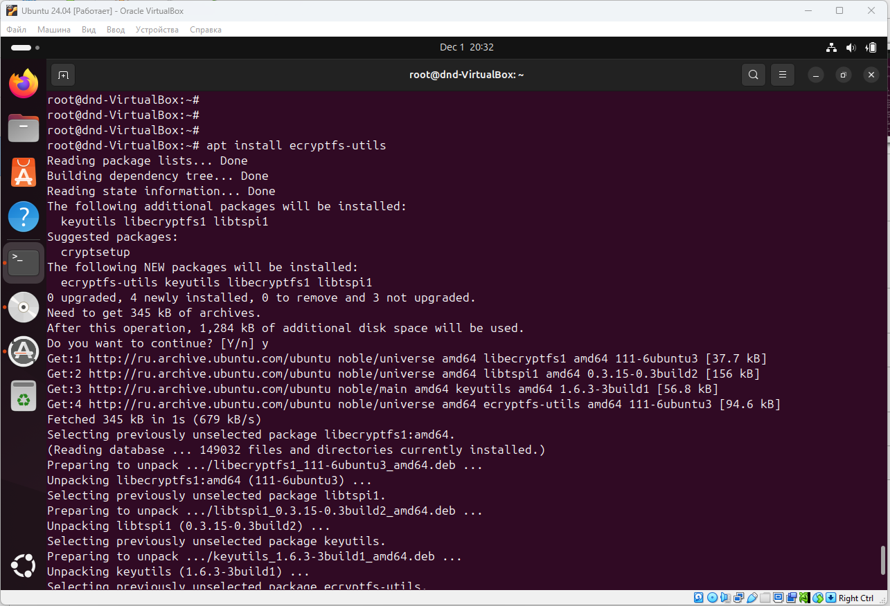
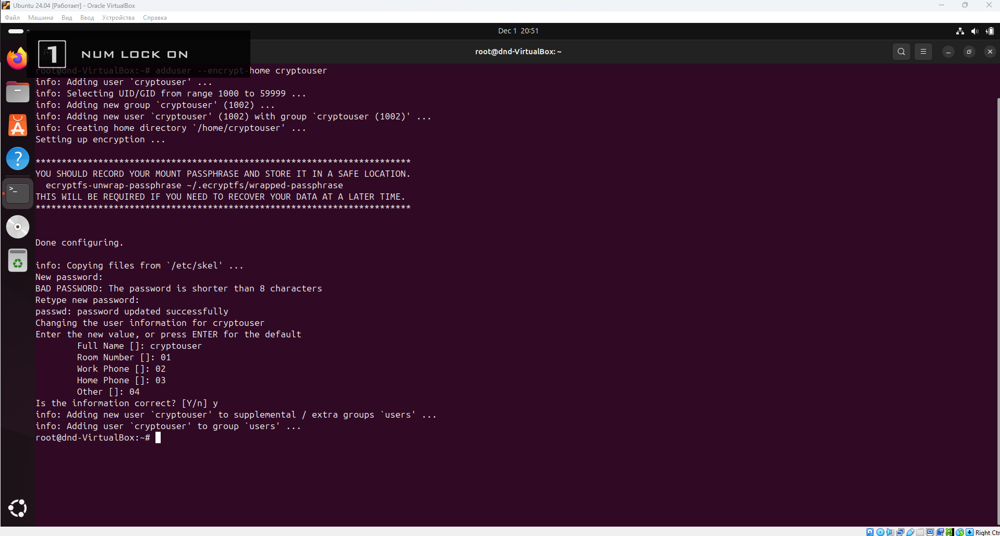

# Домашнее задание к занятию "`Защита хоста`" - `Дедюрин Денис`

---
## Задание 1
Установите eCryptfs.

Добавьте пользователя cryptouser.

Зашифруйте домашний каталог пользователя с помощью eCryptfs.

В качестве ответа пришлите снимки экрана домашнего каталога пользователя с исходными и зашифрованными данными.

### Ответ:
Устанавливаем eCryptfs.
```
apt install ecryptfs-utils
```


Создаем пользователя cryptouser.
```
adduser --encrypt-home cryptouser
```


Далее, проверяем как работает шифрование. Заходим под созданным пользователем.
```
su -  cryptouser
```


---
## Задание 2
Установите поддержку LUKS.

Создайте небольшой раздел, например, 100 Мб.

Зашифруйте созданный раздел с помощью LUKS.

В качестве ответа пришлите снимки экрана с поэтапным выполнением задания.

### Ответ:

---
## Задание 3*

Установите apparmor.

Повторите эксперимент, указанный в лекции.

Отключите (удалите) apparmor.

В качестве ответа пришлите снимки экрана с поэтапным выполнением задания.